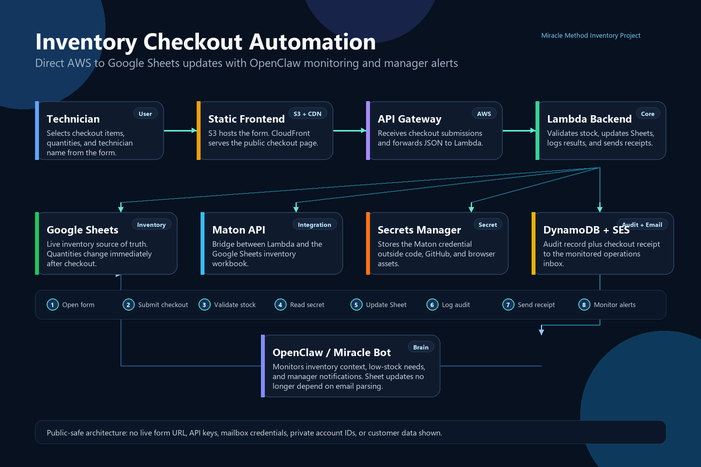
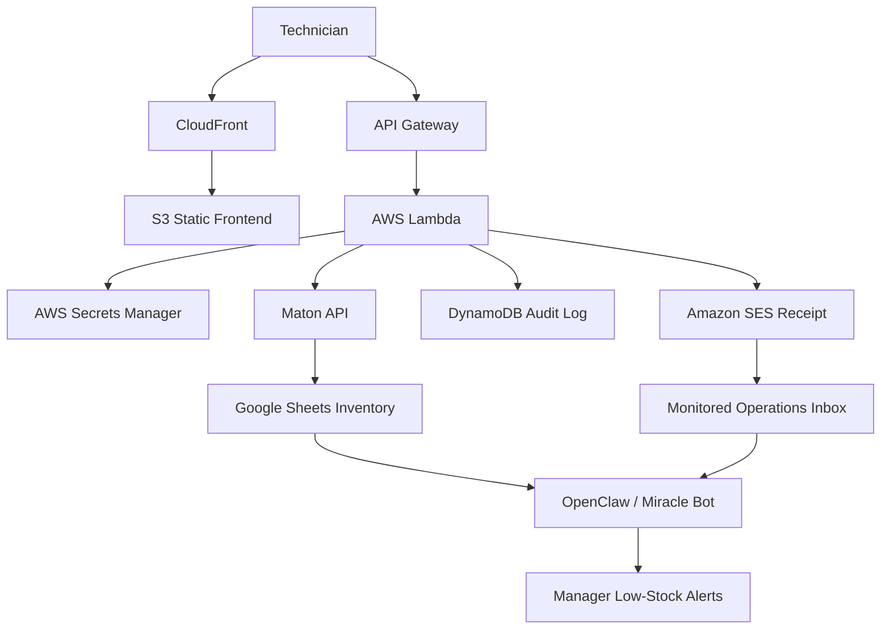
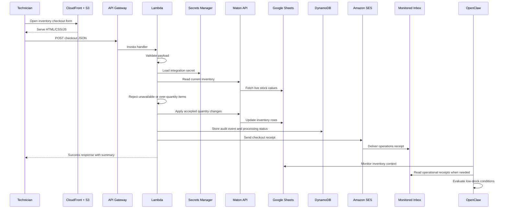

# Miracle Method Inventory Checkout Automation



## Repository

- GitHub Repo: [https://github.com/iamMichaelSmith/MiracleMethodInventory](https://github.com/iamMichaelSmith/MiracleMethodInventory)

> Note: the live production deployment is intentionally not linked from this public repository.

## Elevator Pitch

I built this project to solve a very unglamorous but very real inventory problem: technicians were using materials every day, and the business had no dependable way to capture that usage in real time. That meant stockouts were discovered late, reordering was reactive, and everyone got to enjoy the classic “how the hell are we out of that already?” moment. The fix was a serverless AWS workflow that captures inventory checkouts at the point of use, stores them durably, and routes them into downstream automation for inventory updates and future low-stock alerting.

## Tech Stack

| Layer | Technology | Purpose |
|---|---|---|
| Frontend | HTML, CSS, JavaScript | Mobile-friendly checkout form |
| Static Hosting | Amazon S3 | Stores frontend assets |
| CDN / HTTPS | Amazon CloudFront | Public HTTPS delivery |
| API Layer | Amazon API Gateway | Accepts form submissions |
| Compute | AWS Lambda | Validates and processes checkouts |
| Data Store | Amazon DynamoDB | Persists durable checkout events and backend status |
| Secret Management | AWS Secrets Manager | Stores private integration credentials outside the codebase |
| Inventory Integration | Maton API | Connects Lambda to Google Sheets |
| Email Notification | Amazon SES | Sends checkout receipts to the monitored operations inbox |
| Monitoring Automation | OpenClaw | Watches inventory context and supports low-stock manager alerts |
| Inventory System of Record | Google Sheets | Current operational inventory source, updated directly by Lambda |

## Project Summary

This project is a serverless inventory checkout system designed to solve a recurring operations problem: inventory was being consumed every day, but there was no reliable process for capturing what technicians took, when stock levels were falling, or when reorders needed to happen.

That gap caused real business damage:

- Inventory counts drifted away from reality
- Paints and consumables could run out unexpectedly
- Managers often discovered shortages too late
- Purchasing became reactive instead of planned
- Technicians lost time working around missing materials

The system introduced a lightweight technician-facing checkout workflow backed by AWS infrastructure. Technicians submit inventory usage from a mobile-friendly form, Lambda validates the request, updates the live Google Sheets inventory through Maton, stores a durable audit record, and sends an operations receipt through SES. OpenClaw remains in the loop for monitoring and alerting, but the inventory update no longer depends on delayed email parsing. Nothing fancy for the sake of being fancy—just a practical system that fixes a practical mess.

This project demonstrates practical full-stack and cloud engineering applied to a real workflow problem, not just a demo application.

---

## Key Outcomes

- Replaced an ad hoc, memory-driven inventory process with a structured cloud workflow
- Created durable event storage and direct inventory updates for each technician's checkout
- Reduced the risk of silent inventory depletion going unnoticed
- Preserved compatibility with existing business operations instead of forcing a disruptive process rewrite
- Established a foundation for future reorder automation, low-stock alerting, and internal reporting

---

## Resume-Style Highlights

- Designed and implemented a serverless inventory checkout system using `S3`, `CloudFront`, `API Gateway`, `Lambda`, `DynamoDB`, `Secrets Manager`, `SES`, and Google Sheets integration
- Built a mobile-friendly frontend for technicians to submit paints, primers, and supply checkouts in the shop
- Created an event-driven backend that validates requests, updates Google Sheets directly, stores durable records, and routes receipts into downstream automation
- Solved a real operational issue where stock levels could quietly collapse before anyone knew a reorder was needed
- Architected the system to preserve compatibility with existing Google Sheets operations while removing email parsing from the critical inventory-update path

---

## Problem Statement

The root issue was not the absence of an inventory sheet. The root issue was that the inventory process completely broke down at the point of consumption.

Technicians were using shop inventory in the normal course of work, but there was no consistent, fast, technician-friendly mechanism for logging that usage as it happened. As a result:

- Actual on-hand inventory diverged from spreadsheet counts
- Managers lacked real visibility into inventory drawdown
- No one had dependable early warning when reorder thresholds were crossed
- Shortages were discovered after they had already become operational problems

In practical terms, the inventory would tank, and no one knew items needed to be ordered until things were already bad. The spreadsheet existed, sure, but a spreadsheet by itself does not magically stop people from grabbing supplies and walking off with them.

That made this an operations automation problem, not just a form-building problem.

---

## Project Goal

The objective was to create a low-friction system that technicians would actually use while preserving a secure and extensible backend architecture.

The solution needed to:

- Work quickly on a phone
- Require minimal user input
- Support multiple inventory items per checkout
- Keep secrets and private credentials out of browser code
- Create a durable system-of-record event for each checkout
- Update Google Sheets directly while keeping OpenClaw available for monitoring and low-stock alerting
- Support future low-stock alerting and reorder automation

---

## Solution Overview

The completed system is a cloud-based inventory checkout workflow with a static frontend and a serverless AWS backend. The goal was not to build a bloated internal platform on day one; it was to create the smallest thing that would reliably prevent inventory from going off the rails.

### Technician Experience

Technicians:

- Open a public mobile-friendly inventory form
- Select their name from a controlled dropdown
- Select paints, primers, and supplies
- Choose quantity for supply items
- Submit the checkout
- Review a submitted-order summary for screenshot reference

### Backend Processing

The backend:

1. Receives the checkout over HTTPS
2. Validates and normalizes the payload
3. Checks live stock data before accepting the request
4. Retrieves the private Google Sheets integration credential from Secrets Manager
5. Updates the Google Sheets inventory through Maton
6. Stores the submission and processing status in DynamoDB
7. Sends a checkout receipt through SES to the monitored operations inbox
8. Supports downstream OpenClaw monitoring and low-stock alerting

This design creates both immediate workflow value and future automation flexibility.

---

## Architecture at a Glance



---

## End-to-End Request Flow



---

## System Boundaries

This repository covers the inventory checkout application, AWS backend, direct Google Sheets update path, and public-safe documentation assets.

### Included in this project

- Technician-facing inventory checkout UI
- Cloud ingestion endpoint
- Payload validation
- Durable event storage
- Direct Google Sheets inventory updates through Maton
- Secret retrieval through AWS Secrets Manager
- Email receipt routing into the monitored operations inbox

### Downstream but outside this repository

- OpenClaw monitoring logic
- Future reorder decisioning
- Future manager alerting rules

This distinction matters because it shows where the engineered system in this repository stops and where downstream business automation continues.

---

## AWS Services Used

### Amazon S3

**Purpose:** Static frontend hosting

S3 stores the inventory form assets:

- `index.html`
- `styles.css`
- `app.js`

Why it fits:

- Low operational overhead
- Inexpensive static hosting
- Ideal for a lightweight internal-use frontend

### Amazon CloudFront

**Purpose:** HTTPS delivery, caching, and public edge access

CloudFront sits in front of S3, so technicians can use a clean HTTPS URL for browser-compatible, secure delivery.

Why it fits:

- Reliable frontend delivery
- HTTPS support
- Better production posture than plain S3 website hosting alone

### Amazon API Gateway

**Purpose:** public HTTPS submission endpoint

API Gateway receives structured checkout payloads from the frontend and forwards them to the Lambda function.

Why it fits:

- Clean separation between client and server logic
- Native integration with Lambda
- Simple browser-oriented API surface

### AWS Lambda

**Purpose:** serverless request processing

Lambda handles the application logic:

- Request validation
- Payload normalization
- Live stock checks
- Google Sheets inventory updates through Maton
- Durable write to DynamoDB
- Outbound SES receipt trigger

Why it fits:

- No server management
- Event-driven compute
- Scalable and cost-efficient for intermittent form submissions

### Amazon DynamoDB

**Purpose:** durable submission store

Every checkout is stored as a durable event record with processing status.

Why that matters:

- Creates an audit layer independent of email
- Preserves request data and processing results
- Supports auditability, reporting, and future dashboards

### AWS Secrets Manager

**Purpose:** private integration credential storage

Secrets Manager keeps the Maton integration credential out of browser JavaScript, GitHub, and static deployment assets.

Why it fits:

- Avoids hardcoding private credentials
- Keeps secret access server-side inside Lambda
- Supports safer credential rotation later

### Maton API

**Purpose:** Google Sheets integration bridge

Maton gives Lambda a controlled way to read and update the live Google Sheets inventory workbook.

Why it fits:

- Keeps Google account access outside the frontend
- Allows immediate inventory updates after checkout
- Removes email parsing from the critical stock-update path

### Amazon SES

**Purpose:** automated checkout receipt

SES sends a structured receipt version of each checkout to the monitored operations mailbox.

Why it fits:

- Gives the team an operational receipt for each checkout
- Keeps OpenClaw and inbox-based monitoring compatible without making email the inventory-update mechanism

---

## Current Technical Scope

### Frontend

The frontend is intentionally simple and optimized for technician usage in the shop.

Key UI capabilities:

- Required technician dropdown
- Paints and primers section
- Supplies section
- Quantity controls tuned by item type
- Selected-items summary
- Post-submit summary page for screenshots
- Clear/reset action
- Visible success and error feedback

### Backend

The backend is a serverless processing layer that accepts structured checkout data, updates live inventory, stores audit records, and sends operational receipts.

Core responsibilities:

- Accept JSON checkouts over HTTPS
- Validate required input
- Check requested quantities against live inventory
- Update Google Sheets through Maton
- Persist the event and processing status
- Email the receipt to the monitored inbox

### Automation Handoff

OpenClaw monitors the inventory context and operational receipts for low-stock awareness and manager notification workflows.

This is an intentional practical architecture:

- It updates inventory immediately
- It preserves compatibility with the current workflow
- It leaves room for more advanced alerting and reporting later

In other words, I did not rip out the whole process and replace it with something “more modern” just to make a prettier architecture diagram. I fixed the part that was actually costing the business time and money, then tightened the weak spot where email parsing could delay inventory updates.

---

## Representative Use Case


---

## Data Model

Each checkout submission includes:

- Request type
- Source
- Request ID
- Technician
- Job/customer
- Timestamp
- Selected items

Each item includes:

- Item ID
- Item name
- Category
- Quantity
- Unit

This structured model supports:

- Durable event logging
- Direct inventory updates
- Historical reporting
- Low-stock analysis
- Future reorder automation

---

## Why This Architecture Was Chosen

### 1. Static Frontend Instead of a Framework-Heavy App

The user-facing problem was straightforward:

- Choose items
- Choose quantities
- Submit a payload

A plain HTML/CSS/JavaScript frontend was the right decision because it kept complexity low, deployment simple, and maintenance overhead small. A React stack would have been possible. It also would have been overkill as hell for this problem.

### 2. Serverless Backend Instead of a Persistent App Server

The workload is event-driven and intermittent. Lambda and API Gateway are a better fit than maintaining a traditional backend service for relatively small bursts of traffic.

### 3. DynamoDB Plus Direct Sheet Updates Instead of Email Alone

Email is useful for workflow visibility, but it is not a durable system of record and it should not be the only mechanism responsible for inventory accuracy.

The current design adds:

- Google Sheets updates at checkout time
- DynamoDB persistence and recoverability
- Traceability for each backend result
- Future reporting capability

### 4. Compatibility With Existing Business Operations

The goal was not to replace every existing process at once. The goal was to fix the highest-value failure point first: inventory usage capture.

Updating Google Sheets directly fixed the critical inventory accuracy problem, while SES receipts and OpenClaw monitoring preserved continuity with the way the shop already works.

That tradeoff matters. A technically “perfect” system that nobody adopts is useless. A practical system that fits the way people already work is usually the better bet.

---

## Outcome and Business Impact

This system improves operations in several ways:

- Inventory usage becomes visible at the moment of checkout
- Managers gain a durable record of what is left in inventory
- The business is less likely to discover shortages after they have already affected jobs
- Reorder decisions can become proactive instead of reactive
- Future low-stock automation becomes technically feasible

The biggest operational win is that inventory depletion no longer depends entirely on memory, manual follow-up, or delayed spreadsheet updates. That alone cuts out a lot of avoidable chaos.

---

## Challenges Solved

### Inventory Visibility Failure

The most important issue was the lack of visibility. Materials could be consumed quickly without any timely signal reaching the people responsible for reordering.

This project solved that by creating a structured checkout event every time materials leave inventory.

### Technician Adoption Risk

If the form had been slow or complicated, people would not use it consistently.

This project addressed that by:

- Making the form mobile-friendly
- Minimizing required inputs
- Supporting multi-item submissions
- Using constrained dropdowns and quantity controls

If using the system feels annoying, people will stop using it. That is not a theory; that is just how operations work.

### Security and Credential Exposure Risk

Private credentials and automation logic do not belong in client-side JavaScript.

This project keeps sensitive logic in the AWS backend and only exposes the frontend and public API surface required for submission.

---

## Current Limitations

This repository reflects a practical production-minded first version, not a fully mature internal platform.

Current limitations:

- Google Sheets remains the operational source of truth
- Low-stock alerting depends on OpenClaw/manager notification rules outside this repo
- There is no internal manager dashboard yet
- Authentication and role-based access are not yet implemented
- The public frontend should be hardened further if the app expands beyond controlled internal use

These are future enhancement opportunities, not architectural failures.

---

## Security Posture

This project was intentionally structured to avoid leaking sensitive logic into the client.

Security-conscious design choices include:

- No API keys or credentials stored in browser JavaScript
- Private integration credential stored in AWS Secrets Manager
- Backend processing isolated inside AWS Lambda
- Durable storage handled server-side
- Email delivery handled server-side through SES
- Public frontend separated from private automation logic

The current version is optimized for internal operations, not for zero-trust public exposure. Authentication and stricter origin controls are logical next steps if the app evolves.

---

## Future Improvements

### Reporting and Visibility

- Build an internal admin dashboard on top of DynamoDB records
- Add filtering, search, and recent activity views
- Expose inventory movement history

### Alerting and Reorder Logic

- Calculate threshold crossings
- Notify managers when items hit reorder levels
- Recommend reorder quantities

### Workflow Expansion

- Add inventory restock and delivery-confirmation workflows
- Create vendor intake workflows
- Add richer manager-facing reporting beyond the checkout receipt

### Security and Governance

- Add internal authentication
- Restrict allowed origins
- Add environment separation for dev/staging/prod

---

## Repository Structure

```text
MiracleMethodInventory/
|-- aws-inventory-backend/
|   |-- index.mjs
|   |-- package.json
|   `-- README.md
|-- s3-inventory-form/
|   |-- index.html
|   |-- styles.css
|   |-- app.js
|   `-- README.md
|-- n8n_inventory_checkout_email_import.json
|-- n8n_supply_inventory_import.json
|-- n8n_diagnostic_import.json
`-- README.md
```

### Main Areas

- `s3-inventory-form/` contains the technician-facing frontend
- `aws-inventory-backend/` contains the Lambda processing and Google Sheets update logic
- `n8n_*.json` contains related workflow and automation assets

---

## What This Project Demonstrates

This project shows the ability to:

- Identify a business operations failure and convert it into technical requirements
- Design a cloud architecture around a real workflow problem
- Build a frontend suited to constrained real-world usage
- Implement a serverless ingestion pipeline in AWS
- Create durable event storage for operational traceability
- Integrate AWS with Google Sheets through a server-side automation bridge
- Make pragmatic architectural tradeoffs instead of overengineering

This is not just a form. It is an end-to-end operational automation system built around a real inventory-control problem.

---

## Why This Is Portfolio-Worthy

This project is worth showing because it demonstrates more than coding ability. It shows the ability to:

- Identify a real business bottleneck
- Translate that bottleneck into concrete system requirements
- Choose pragmatic technologies instead of overbuilding
- Connect user experience, backend processing, and operational workflow into one coherent system
- Design for extensibility while delivering immediate value

For employers, this is evidence of product thinking, systems thinking, and execution under practical business constraints. It also shows that I know when to build the right thing rather than the most academically impressive one.

---

## Safe Documentation Note

This repository intentionally excludes:

- API keys
- Private credentials
- Secrets
- Mailbox passwords
- Sensitive internal identifiers not required for architectural review

The purpose of this documentation is to explain the implementation, tradeoffs, and business impact without exposing sensitive information.

---

## Employer-Facing Summary

Built a serverless inventory checkout automation system to solve a real operational failure in which supply usage was not captured reliably and inventory shortages were discovered too late. Designed and implemented a mobile-friendly checkout frontend plus an AWS backend using S3, CloudFront, API Gateway, Lambda, DynamoDB, Secrets Manager, SES, Maton, and Google Sheets. The system captures technician inventory usage as structured events, validates live stock, updates the inventory sheet directly, persists durable audit records, and keeps OpenClaw available for monitoring and future low-stock alerting.


