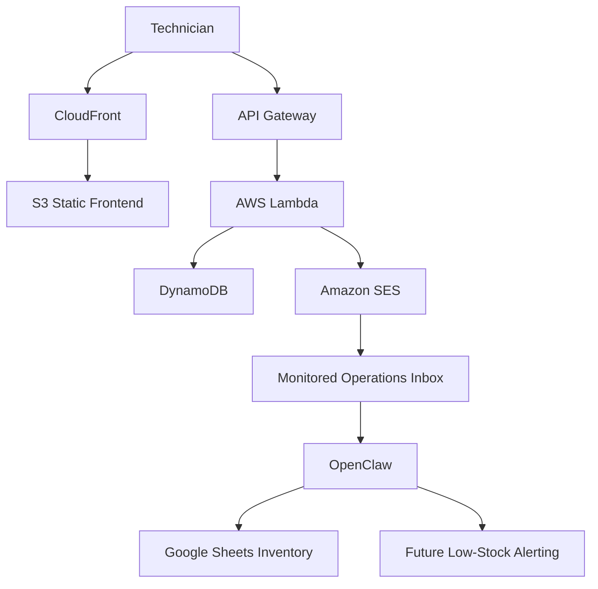
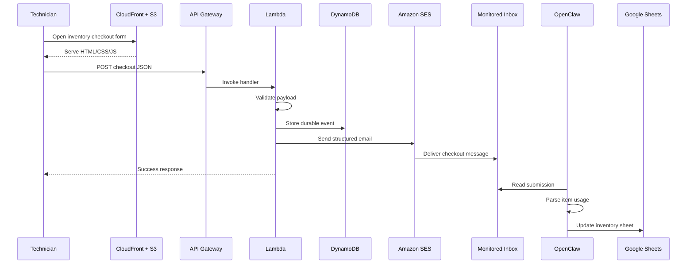

# Miracle Method Inventory Checkout Automation

## Project Summary

This project is a serverless inventory checkout system designed to solve a recurring operations problem: inventory consumption was happening daily, but there was no reliable process for capturing what technicians took, when stock levels were falling, or when reorders needed to happen.

That gap caused real business damage:

- inventory counts drifted away from reality
- paints and consumables could run out unexpectedly
- managers often discovered shortages too late
- purchasing became reactive instead of planned
- technicians lost time working around missing materials

The system introduced a lightweight technician-facing checkout workflow backed by AWS infrastructure. Technicians submit inventory usage from a mobile-friendly form, AWS stores the submission as a durable event, and the system forwards the checkout into the downstream automation process that OpenClaw uses to update inventory records.

This project demonstrates practical full-stack and cloud engineering applied to a real workflow problem, not just a demo application.

---

## Resume-Style Highlights

- Designed and implemented a serverless inventory checkout system using `S3`, `CloudFront`, `API Gateway`, `Lambda`, `DynamoDB`, and `SES`
- Built a mobile-friendly frontend for technicians to submit paints, primers, and supply checkouts in the shop
- Created an event-driven backend that validates requests, stores durable records, and routes structured inventory usage into downstream automation
- Solved a real operational issue where stock levels could quietly collapse before anyone knew a reorder was needed
- Architected the system to preserve compatibility with existing Google Sheets and email-based business processes while creating a foundation for future low-stock automation

---

## Problem Statement

The root issue was not the absence of an inventory sheet. The issue was that the inventory process broke down at the point of consumption.

Technicians were using shop inventory in the normal course of work, but there was no consistent, fast, technician-friendly mechanism for logging that usage as it happened. As a result:

- actual on-hand inventory diverged from spreadsheet counts
- managers lacked real visibility into inventory drawdown
- no one had dependable early warning when reorder thresholds were crossed
- shortages were discovered after they had already become operational problems

In practical terms, the inventory would tank and no one knew items needed to be ordered until things were already bad.

That made this an operations automation problem, not just a form-building problem.

---

## Project Goal

The objective was to create a low-friction system that technicians would actually use while preserving a secure and extensible backend architecture.

The solution needed to:

- work quickly on a phone
- require minimal user input
- support multiple inventory items per checkout
- keep secrets and private credentials out of browser code
- create a durable system-of-record event for each checkout
- feed into the existing OpenClaw + Google Sheets workflow
- support future low-stock alerting and reorder automation

---

## Solution Overview

The completed system is a cloud-based inventory checkout workflow with a static frontend and a serverless AWS backend.

### Technician Experience

Technicians:

- open a public mobile-friendly inventory form
- select their name from a controlled dropdown
- optionally enter job or customer context
- select paints, primers, and supplies
- choose quantity for supply items
- submit the checkout

### Backend Processing

The backend:

1. receives the checkout over HTTPS
2. validates and normalizes the payload
3. stores the submission in DynamoDB
4. sends the checkout via SES email to the monitored operations inbox
5. supports downstream OpenClaw processing against Google Sheets inventory

This design creates both immediate workflow value and future automation flexibility.

---

## Architecture at a Glance



---

## End-to-End Request Flow



---

## AWS Services Used

### Amazon S3

**Purpose:** static frontend hosting

S3 stores the inventory form assets:

- `index.html`
- `styles.css`
- `app.js`

Why it fits:

- low operational overhead
- inexpensive static hosting
- ideal for a lightweight internal-use frontend

### Amazon CloudFront

**Purpose:** HTTPS delivery, caching, and public edge access

CloudFront sits in front of S3 so technicians can use a clean HTTPS URL with browser-compatible secure delivery.

Why it fits:

- reliable frontend delivery
- HTTPS support
- better production posture than plain S3 website hosting alone

### Amazon API Gateway

**Purpose:** public HTTPS submission endpoint

API Gateway receives structured checkout payloads from the frontend and forwards them to the Lambda function.

Why it fits:

- clean separation between client and server logic
- native integration with Lambda
- simple browser-oriented API surface

### AWS Lambda

**Purpose:** serverless request processing

Lambda handles the application logic:

- request validation
- payload normalization
- durable write to DynamoDB
- outbound SES email trigger

Why it fits:

- no server management
- event-driven compute
- scalable and cost-efficient for intermittent form submissions

### Amazon DynamoDB

**Purpose:** durable submission store

Every successful checkout is stored as a durable event record.

Why that matters:

- creates a system-of-record layer independent of email
- preserves data even if downstream processing is delayed
- supports auditability, reporting, and future dashboards

### Amazon SES

**Purpose:** automated email handoff

SES sends a structured email version of each checkout to the monitored mailbox that OpenClaw processes.

Why it fits:

- bridges AWS and the current business workflow
- enables automation without forcing a rewrite of downstream operations

---

## Current Technical Scope

### Frontend

The frontend is intentionally simple and optimized for technician usage in the shop.

Key UI capabilities:

- required technician dropdown
- optional job/customer field
- paints and primers section
- supplies section
- quantity control for supply items only
- selected-items summary
- clear/reset action
- visible success and error feedback

### Backend

The backend is a serverless ingestion layer that accepts structured checkout data and routes it into storage plus workflow automation.

Core responsibilities:

- accept JSON checkouts over HTTPS
- validate required input
- persist the event
- email the submission to the monitored inbox

### Automation Handoff

OpenClaw reads the monitored mailbox and updates the inventory spreadsheet.

This is an intentional transitional architecture:

- it solves the inventory capture problem immediately
- it preserves compatibility with the current workflow
- it leaves room for more advanced automation later

---

## Data Model

Each checkout submission includes:

- request type
- source
- request ID
- technician
- job/customer
- timestamp
- selected items

Each item includes:

- item ID
- item name
- category
- quantity
- unit

This structured model supports:

- durable event logging
- downstream parsing
- historical reporting
- low-stock analysis
- future reorder automation

---

## Why This Architecture Was Chosen

### 1. Static Frontend Instead of a Framework-Heavy App

The user-facing problem was straightforward:

- choose items
- choose quantities
- submit a payload

A plain HTML/CSS/JavaScript frontend was the right decision because it kept complexity low, deployment simple, and maintenance overhead small.

### 2. Serverless Backend Instead of a Persistent App Server

The workload is event-driven and intermittent. Lambda and API Gateway are a better fit than maintaining a traditional backend service for relatively small bursts of traffic.

### 3. DynamoDB Plus Email Instead of Email Alone

Email is useful for workflow integration, but it is not a durable system of record by itself.

DynamoDB adds:

- persistence
- recoverability
- traceability
- future reporting capability

### 4. Compatibility With Existing Business Operations

The goal was not to replace every existing process at once. The goal was to fix the highest-value failure point first: inventory usage capture.

Routing structured data into the monitored inbox preserved continuity while significantly improving data capture quality.

---

## Outcome and Business Impact

This system improves operations in several ways:

- inventory usage becomes visible at the moment of checkout
- managers gain a durable record of what left inventory
- the business is less likely to discover shortages after they already affect jobs
- reorder decisions can become proactive instead of reactive
- future low-stock automation becomes technically feasible

The biggest operational win is that inventory depletion no longer depends entirely on memory, manual follow-up, or delayed spreadsheet updates.

---

## Challenges Solved

### Inventory Visibility Failure

The most important issue was lack of visibility. Materials could be consumed quickly without any timely signal reaching the people responsible for reordering.

This project solved that by creating a structured checkout event every time materials leave inventory.

### Technician Adoption Risk

If the form had been slow or complicated, people would not use it consistently.

This project addressed that by:

- making the form mobile-friendly
- minimizing required inputs
- supporting multi-item submissions
- using constrained dropdowns and quantity controls

### Security and Credential Exposure Risk

Private credentials and automation logic do not belong in client-side JavaScript.

This project keeps sensitive logic in the AWS backend and only exposes the frontend and public API surface required for submission.

---

## Current Limitations

This repository reflects a practical production-minded first version, not a fully mature internal platform.

Current limitations:

- Google Sheets remains the source of truth downstream
- OpenClaw still depends on inbox processing
- low-stock alerting is supported conceptually but not fully implemented end to end here
- there is no internal manager dashboard yet
- authentication and role-based access are not yet implemented

These are future enhancement opportunities, not architectural failures.

---

## Future Improvements

### Reporting and Visibility

- build an internal admin dashboard on top of DynamoDB records
- add filtering, search, and recent activity views
- expose inventory movement history

### Alerting and Reorder Logic

- compare checkouts against current stock automatically
- calculate threshold crossings
- notify managers when items hit reorder levels
- recommend reorder quantities

### Workflow Expansion

- add inventory restock and delivery-confirmation workflows
- create vendor intake workflows
- support direct downstream integrations beyond email

### Security and Governance

- add internal authentication
- restrict allowed origins
- add environment separation for dev/staging/prod

---

## Repository Structure

```text
MiracleMethodInventory/
|-- aws-inventory-backend/
|   |-- index.mjs
|   |-- package.json
|   `-- README.md
|-- s3-inventory-form/
|   |-- index.html
|   |-- styles.css
|   |-- app.js
|   `-- README.md
|-- n8n_inventory_checkout_email_import.json
|-- n8n_supply_inventory_import.json
|-- n8n_diagnostic_import.json
`-- README.md
```

### Main Areas

- `s3-inventory-form/` contains the technician-facing frontend
- `aws-inventory-backend/` contains the Lambda ingestion logic
- `n8n_*.json` contains related workflow and automation assets

---

## What This Project Demonstrates

This project shows the ability to:

- identify a business operations failure and convert it into technical requirements
- design a cloud architecture around a real workflow problem
- build a frontend suited to constrained real-world usage
- implement a serverless ingestion pipeline in AWS
- create durable event storage for operational traceability
- integrate cloud infrastructure with an automation-driven downstream process
- make pragmatic architectural tradeoffs instead of overengineering

This is not just a form. It is an end-to-end operational automation system built around a real inventory-control problem.

---

## Safe Documentation Note

This repository intentionally excludes:

- API keys
- private credentials
- secrets
- mailbox passwords
- sensitive internal identifiers not required for architectural review

The purpose of this documentation is to explain the implementation, tradeoffs, and business impact without exposing sensitive information.

---

## Employer-Facing Summary

Built a serverless inventory checkout automation system to solve a real operational failure in which supply usage was not captured reliably and inventory shortages were discovered too late. Designed and implemented a mobile-friendly checkout frontend plus an AWS backend using S3, CloudFront, API Gateway, Lambda, DynamoDB, and SES. The system captures technician inventory usage as structured events, persists durable records, and routes submissions into downstream automation for inventory updates and future low-stock alerting.
